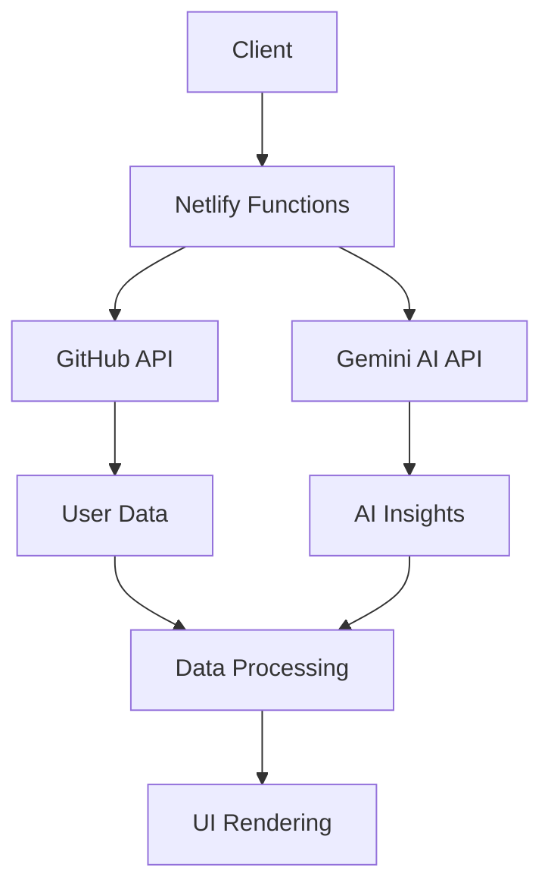

# 🔌 DevWrapped 2025 - API Documentation

<div align="center">
  <h1>🎬 API Reference</h1>
  <p><em>Complete guide to DevWrapped 2025 API integration</em></p>
  
  
  
  
</div>

---

## 📋 Table of Contents

1. [🎯 Overview](#-overview)
2. [🔑 Authentication](#-authentication)
3. [🐙 GitHub API Integration](#-github-api-integration)
4. [🤖 Gemini AI Integration](#-gemini-ai-integration)
5. [🌐 Netlify Functions](#-netlify-functions)
6. [📊 Data Models](#-data-models)
7. [🔄 Error Handling](#-error-handling)
8. [📈 Rate Limiting](#-rate-limiting)
9. [🧪 Testing](#-testing)

---

## 🎯 Overview

DevWrapped 2025 integrates with multiple APIs to provide comprehensive GitHub analysis and AI-powered insights. The application uses a serverless architecture with Netlify Functions as proxy servers to handle API communications securely.

### 🏗️ Architecture



### 🔄 Data Flow

1. **Client Request**: User submits GitHub username
2. **Proxy Functions**: Netlify Functions handle API calls
3. **Data Fetching**: Parallel GitHub API requests
4. **Processing**: Centralized contribution calculation
5. **AI Generation**: Gemini AI creates insights
6. **Response**: Structured data returned to client

---

## 🔑 Authentication

### 🔒 API Key Management

DevWrapped 2025 uses server-side API key storage for security:

```typescript
// Environment Variables (Server-side only)
GEMINI_API_KEY=your_gemini_api_key_here

// Client never has direct access to API keys
// All requests go through Netlify Functions proxy
```

### 🐙 GitHub API Access

- **Public Data Only**: No authentication required
- **Rate Limits**: 60 requests/hour per IP (unauthenticated)
- **Scope**: Public repositories, events, and user profiles only

### 🤖 Gemini AI Access

- **API Key Required**: Stored in Netlify environment variables
- **Models**: `gemini-3-flash-preview` (primary), `gemini-3-flash-lite` (fallback)
- **Rate Limits**: Based on Google AI Studio quotas

---

## 🐙 GitHub API Integration

### 📡 Endpoints Used

#### **1. User Profile**
```http
GET /users/{username}
```

**Response:**
```json
{
  "login": "octocat",
  "avatar_url": "https://github.com/images/error/octocat_happy.gif",
  "html_url": "https://github.com/octocat",
  "name": "The Octocat",
  "company": "GitHub",
  "location": "San Francisco",
  "bio": "There once was...",
  "public_repos": 8,
  "followers": 20,
  "following": 0,
  "created_at": "2008-01-14T04:33:35Z"
}
```

#### **2. Public Repositories**
```http
GET /users/{username}/repos?sort=updated&per_page=100&page=1
```

**Parameters:**
- `sort`: `updated` (most recently updated first)
- `per_page`: `100` (maximum per request)
- `page`: Pagination parameter

**Response:**
```json
[
  {
    "name": "Hello-World",
    "html_url": "https://github.com/octocat/Hello-World",
    "description": "This your first repo!",
    "language": "C",
    "stargazers_count": 80,
    "created_at": "2011-01-26T19:01:12Z",
    "updated_at": "2011-01-26T19:14:43Z",
    "private": false
  }
]
```

#### **3. Public Events**
```http
GET /users/{username}/events/public?per_page=100&page=1
```

**Response:**
```json
[
  {
    "id": "1234567890",
    "type": "PushEvent",
    "created_at": "2025-01-15T10:30:00Z",
    "repo": {
      "name": "octocat/Hello-World"
    },
    "payload": {
      "commits": [
        {
          "sha": "abc123",
          "message": "Add feature"
        }
      ]
    }
  }
]
```

#### **4. Commit Search**
```http
GET /search/commits?q=author:{username}+committer-date:>=2025-01-01&per_page=1
```

**Response:**
```json
{
  "total_count": 42,
  "items": [
    {
      "sha": "abc123",
      "commit": {
        "author": {
          "name": "Octocat",
          "date": "2025-01-15T10:30:00Z"
        },
        "message": "Add new feature"
      }
    }
  ]
}
```

### 🔄 Data Processing Pipeline

#### **1. Parallel Data Fetching**
```typescript
const fetchGitHubData = async (username: string): Promise<GitHubStats> => {
  // Parallel API calls for efficiency
  const [userData, repos, basicEvents, enhancedEvents] = await Promise.all([
    fetchViaProxy(`/users/${username}`, username, 5000),
    fetchAllRepos(username),
    fetchYearEvents(username),
    getEnhancedActivityData(username)
  ]);
  
  // Process and combine data
  return processGitHubData(userData, repos, events);
};
```

#### **2. Centralized Contribution Calculation**
```typescript
const calculateContributionStats = (events: any[], repos: any[]) => {
  const year2025Start = new Date('2025-01-01');
  const today = new Date();
  
  // Filter events for 2025 only
  const events2025 = events.filter(event => {
    const eventDate = new Date(event.created_at);
    return eventDate >= year2025Start && eventDate <= today;
  });
  
  // Count different types of contributions
  let totalContributions = 0;
  const dailyContributions = new Map<string, number>();
  const monthlyContributions = new Map<string, number>();
  
  events2025.forEach(event => {
    const eventDate = new Date(event.created_at);
    const dateStr = eventDate.toISOString().split('T')[0];
    const monthKey = eventDate.toISOString().slice(0, 7);
    
    let contributionCount = 0;
    switch (event.type) {
      case 'PushEvent':
        contributionCount = event.payload?.commits?.length || 1;
        break;
      case 'CreateEvent':
      case 'IssuesEvent':
      case 'PullRequestEvent':
        contributionCount = 1;
        break;
      default:
        contributionCount = 0;
    }
    
    if (contributionCount > 0) {
      totalContributions += contributionCount;
      dailyContributions.set(dateStr, 
        (dailyContributions.get(dateStr) || 0) + contributionCount);
      monthlyContributions.set(monthKey, 
        (monthlyContributions.get(monthKey) || 0) + contributionCount);
    }
  });
  
  return {
    totalContributions,
    activeDays: dailyContributions.size,
    monthlyActivity: generateMonthlyActivity(monthlyContributions)
  };
};
```

#### **3. Monthly Activity Grid Generation**
```typescript
const generateMonthlyActivity = (monthlyContributions: Map<string, number>) => {
  const months = ['Jan', 'Feb', 'Mar', 'Apr', 'May', 'Jun', 
                  'Jul', 'Aug', 'Sep', 'Oct', 'Nov', 'Dec'];
  const monthlyActivity = [];
  
  for (let i = 0; i < 12; i++) {
    const monthKey = `2025-${String(i + 1).padStart(2, '0')}`;
    const currentMonth = new Date(2025, i, 1);
    
    if (currentMonth <= new Date()) {
      const count = monthlyContributions.get(monthKey) || 0;
      
      // Calculate activity level (0-4)
      let level = 0;
      if (count >= 1) level = 1;
      if (count >= 5) level = 2;
      if (count >= 15) level = 3;
      if (count >= 30) level = 4;
      
      monthlyActivity.push({ 
        month: months[i], 
        count, 
        level 
      });
    }
  }
  
  return monthlyActivity;
};
```

---

## 🤖 Gemini AI Integration

### 🧠 AI Engine Optimization (AEO)

DevWrapped 2025 features advanced **AI Engine Optimization (AEO)** for superior AI-generated insights and narratives.

#### **AEO Features**
- **Dynamic Year-Aware Prompting**: AI prompts adapt based on selected analysis year
- **Enhanced Data Context**: 20+ comprehensive data points for better analysis
- **Advanced Model Configuration**: Optimized parameters for quality and performance
- **10 Distinct Archetypes**: Data-driven developer persona classification
- **Performance Monitoring**: Real-time processing metrics and quality validation

### 🎯 AI Models

#### **Primary Model: gemini-3-flash-preview**
- **Use Case**: Full feature set with advanced insights
- **Capabilities**: Complex reasoning, detailed analysis
- **Rate Limits**: Higher quota requirements
- **AEO Configuration**:
  ```typescript
  config: {
    temperature: 0.7,        // Balanced creativity vs consistency
    topK: 40,               // Focused vocabulary selection
    topP: 0.9,              // High-quality token sampling
    maxOutputTokens: 4096,  // Sufficient for detailed analysis
    candidateCount: 1       // Single high-quality response
  }
  ```

#### **Fallback Model: gemini-3-flash-lite**
- **Use Case**: Economy mode with basic insights
- **Capabilities**: Simplified analysis, faster responses
- **Rate Limits**: Lower quota requirements

### 📝 Advanced Prompt Engineering (AEO)

#### **Dynamic Year-Aware Prompt Structure**
```typescript
const generatePrompt = (stats: GitHubStats) => {
  // AEO: Dynamic year-aware prompt generation
  const currentYear = new Date().getFullYear();
  const analysisYear = stats.analysisYear || currentYear;
  const isCurrentYear = analysisYear === currentYear;
  const yearContext = isCurrentYear ? 
    `current ${analysisYear} activity (partial year data)` : 
    `complete ${analysisYear} development year`;

  return `You are an expert developer analyst creating a comprehensive "${analysisYear} Year Wrapped" report.

ANALYSIS CONTEXT:
- Target Year: ${analysisYear} (${yearContext})
- Data Quality: ${isCurrentYear ? 'Partial year + GitHub API 90-day limitation' : 'Historical data with API limitations'}
- Analysis Date: ${new Date().toISOString().split('T')[0]}

DEVELOPER TELEMETRY:
- Username: ${stats.username}
- Total Contributions: ${stats.totalCommits} (commits, PRs, issues, reviews)
- Active Development Days: ${stats.activeDays} days
- Technology Stack: ${stats.topLanguages.map(l => `${l.name} (${l.count} repos)`).join(', ')}
- Repository Scope: ${stats.reposContributed} total repositories
- Current Streak: ${stats.streak} consecutive days
- Longest Streak: ${stats.longestStreak} days
- Peak Activity Month: ${stats.mostActiveMonth}
- Activity Pattern: ${stats.activityPattern}
- Account Maturity: ${stats.accountAge} years on GitHub
- Community Engagement: ${stats.followers} followers, ${stats.following} following
- Stars Received: ${stats.totalStarsReceived} across all repositories
- New Repositories: ${stats.reposCreatedThisYear} created in ${analysisYear}
- Profile Context: ${stats.bio ? `"${stats.bio}"` : 'No bio'} | ${stats.company || 'No company'} | ${stats.location || 'No location'}

ADVANCED BEHAVIORAL ANALYSIS:
- Contribution Distribution: ${stats.contributionGrid ? stats.contributionGrid.map(m => `${m.month}: ${m.count} (level ${m.level})`).join(', ') : 'Not available'}
- Recent Projects: ${stats.recentRepos.map(r => `${r.name} (${r.language}, ${r.stars} stars)`).join(', ')}

ARCHETYPE SELECTION LOGIC (Choose most fitting):
- "The Architect": High repo breadth (15+) + consistent patterns + complex languages
- "The Explorer": 4+ languages + diverse projects + experimental activity
- "The Craftsperson": Deep focus + quality over quantity + refined tech stack
- "The Collaborator": High social metrics + team repos + consistent contributions
- "The Innovator": New repos created + cutting-edge stack + burst activity patterns
- "The Maintainer": Long streaks (30+) + steady patterns + established projects
- "The Specialist": Deep expertise in 1-2 languages + focused domain
- "The Builder": High commit volume + multiple active projects + creation-focused
- "The Contributor": Open source focus + community engagement + diverse contributions
- "The Learner": Rapid skill acquisition + educational repos + growth trajectory

OUTPUT REQUIREMENTS (STRICT JSON FORMAT):
{
  "archetype": "A compelling developer persona title",
  "archetypeDescription": "One poetic sentence defining their essence",
  "archetypeExplanation": {
    "reasoning": ["3 data-driven reasons for this archetype"],
    "keyFactors": [
      {"factor": "Specific behavioral trait", "evidence": "Concrete data point"},
      {"factor": "Development pattern", "evidence": "Supporting metric"},
      {"factor": "Technical characteristic", "evidence": "Quantified evidence"}
    ],
    "confidence": 0.85
  },
  "executiveSummary": "Two-sentence TL;DR of their ${analysisYear} development journey",
  "insights": [
    "Specific behavioral insight from their coding patterns",
    "Technical growth observation with data backing",
    "Collaboration or productivity insight"
  ],
  "patterns": [
    "High-level development rhythm or habit",
    "Technical or temporal pattern in their work"
  ],
  "narrative": "Three compelling paragraphs telling their ${analysisYear} story. Use \\n\\n between paragraphs. Make it personal, data-driven, and inspiring. Reference specific metrics and achievements.",
  "cardInsight": "Punchy 8-12 word quote perfect for social media sharing",
  "forwardLooking": {
    "recommendations": [
      "Actionable suggestion based on their patterns",
      "Growth opportunity aligned with their strengths",
      "Technical or career advancement recommendation"
    ],
    "risks": [
      "Potential burnout or stagnation risk to monitor",
      "Skill gap or development challenge to address"
    ],
    "opportunities": [
      "Emerging technology or domain to explore",
      "Community or collaboration opportunity"
    ]
  }
}

QUALITY STANDARDS:
- Use specific numbers and metrics in explanations
- Make archetype feel earned and trustworthy
- Ensure narrative flows naturally and tells a compelling story
- Base all insights on actual data patterns
- Keep recommendations actionable and personalized
- Reference ${analysisYear} context throughout

TONE: Professional yet engaging, data-driven but human, celebratory of achievements while providing constructive guidance.`;
};
```

#### **AEO Response Processing with Quality Validation**
```typescript
const processAIResponse = (response: string, processingTime: number): AIInsights => {
  try {
    const parsed = JSON.parse(response);
    
    // AEO: Enhanced validation for quality assurance
    const required = ['archetype', 'archetypeDescription', 'archetypeExplanation', 
                     'narrative', 'cardInsight', 'insights', 'patterns', 
                     'forwardLooking', 'executiveSummary'];
    
    for (const field of required) {
      if (!parsed[field]) {
        console.warn(`AEO: Missing required field: ${field}`);
        throw new Error(`Missing required field: ${field}`);
      }
    }
    
    // AEO: Quality validation
    if (!parsed.archetypeExplanation?.confidence || 
        parsed.archetypeExplanation.confidence < 0.7) {
      console.warn('AEO: Low archetype confidence score');
    }
    
    if (parsed.narrative.length < 200) {
      console.warn('AEO: Narrative too short, may lack depth');
    }
    
    // AEO: Performance logging
    console.log('AEO: Response quality validation passed', {
      processingTime,
      narrativeLength: parsed.narrative.length,
      confidence: parsed.archetypeExplanation?.confidence,
      archetype: parsed.archetype
    });
    
    return parsed as AIInsights;
  } catch (error) {
    console.error('AEO: Response parsing failed, using fallback', error);
    // Fallback to default insights
    return generateFallbackInsights();
  }
};
```

### 🔄 AEO-Enhanced API Request Flow

```typescript
const generateAIWrapped = async (stats: GitHubStats, model: string): Promise<AIInsights> => {
  // AEO: Performance monitoring
  const startTime = Date.now();
  
  console.log('AEO: Starting AI analysis', {
    username: stats.username,
    model: model,
    totalCommits: stats.totalCommits,
    activeDays: stats.activeDays,
    analysisYear: stats.analysisYear || new Date().getFullYear()
  });
  
  const prompt = generatePrompt(stats);
  
  const response = await fetch('/.netlify/functions/gemini-proxy', {
    method: 'POST',
    headers: {
      'Content-Type': 'application/json',
    },
    body: JSON.stringify({
      stats,
      modelName: model
    }),
  });
  
  if (!response.ok) {
    const processingTime = Date.now() - startTime;
    console.error('AEO: AI generation failed', {
      status: response.status,
      processingTime,
      model
    });
    throw new Error(`AI generation failed: ${response.status}`);
  }
  
  const result = await response.json();
  const processingTime = Date.now() - startTime;
  
  // AEO: Enhanced response processing with quality validation
  const insights = processAIResponse(result, processingTime);
  
  console.log('AEO: AI analysis completed successfully', {
    username: stats.username,
    processingTime,
    archetype: insights.archetype,
    model
  });
  
  return insights;
};
```

---

## 🌐 Netlify Functions

### 🔧 Function Architecture

#### **1. GitHub Proxy Function**
**File:** `netlify/functions/github-proxy.ts`

```typescript
export const handler: Handler = async (event, context) => {
  // CORS headers
  const headers = {
    'Access-Control-Allow-Origin': '*',
    'Access-Control-Allow-Headers': 'Content-Type',
    'Access-Control-Allow-Methods': 'POST, OPTIONS',
  };
  
  if (event.httpMethod === 'OPTIONS') {
    return { statusCode: 200, headers, body: '' };
  }
  
  try {
    const { username, endpoint } = JSON.parse(event.body || '{}');
    
    // Validate inputs
    if (!username || !endpoint) {
      return {
        statusCode: 400,
        headers,
        body: JSON.stringify({ error: 'Missing username or endpoint' })
      };
    }
    
    // Make GitHub API request
    const response = await fetch(`https://api.github.com${endpoint}`, {
      headers: {
        'User-Agent': 'DevWrapped-2025',
        'Accept': 'application/vnd.github.v3+json',
      },
    });
    
    if (!response.ok) {
      throw new Error(`GitHub API error: ${response.status}`);
    }
    
    const data = await response.json();
    
    return {
      statusCode: 200,
      headers,
      body: JSON.stringify(data)
    };
  } catch (error) {
    return {
      statusCode: 500,
      headers,
      body: JSON.stringify({ error: error.message })
    };
  }
};
```

#### **2. Gemini AI Proxy Function**
**File:** `netlify/functions/gemini-proxy.ts`

```typescript
export const handler: Handler = async (event, context) => {
  const headers = {
    'Access-Control-Allow-Origin': '*',
    'Access-Control-Allow-Headers': 'Content-Type',
    'Access-Control-Allow-Methods': 'POST, OPTIONS',
  };
  
  if (event.httpMethod === 'OPTIONS') {
    return { statusCode: 200, headers, body: '' };
  }
  
  try {
    const apiKey = process.env.GEMINI_API_KEY;
    if (!apiKey) {
      throw new Error('GEMINI_API_KEY not configured');
    }
    
    const { prompt, model, maxTokens, temperature } = JSON.parse(event.body || '{}');
    
    // Make Gemini API request
    const response = await fetch(`https://generativelanguage.googleapis.com/v1beta/models/${model}:generateContent?key=${apiKey}`, {
      method: 'POST',
      headers: {
        'Content-Type': 'application/json',
      },
      body: JSON.stringify({
        contents: [{
          parts: [{ text: prompt }]
        }],
        generationConfig: {
          maxOutputTokens: maxTokens,
          temperature: temperature,
        },
      }),
    });
    
    if (!response.ok) {
      throw new Error(`Gemini API error: ${response.status}`);
    }
    
    const data = await response.json();
    const content = data.candidates?.[0]?.content?.parts?.[0]?.text;
    
    return {
      statusCode: 200,
      headers,
      body: JSON.stringify({ content })
    };
  } catch (error) {
    return {
      statusCode: 500,
      headers,
      body: JSON.stringify({ error: error.message })
    };
  }
};
```

---

## 📊 Data Models

### 🎯 Core Interfaces

#### **GitHubStats Interface**
```typescript
interface GitHubStats {
  username: string;
  avatarUrl: string;
  profileUrl: string;
  totalCommits: number;
  activeDays: number;
  topLanguages: { name: string; count: number }[];
  allLanguages: { name: string; count: number }[];
  reposContributed: number;
  reposCreatedThisYear: number;
  recentRepos: GitHubRepo[];
  streak: number;
  longestStreak?: number;
  mostActiveMonth: string;
  firstActivity: string;
  lastActivity: string;
  activityPattern: 'burst' | 'consistent' | 'sporadic';
  contributionGrid?: { month: string; count: number; level: number }[];
  followers: number;
  following: number;
  totalStarsReceived: number;
  accountAge: number;
  bio?: string;
  company?: string;
  location?: string;
}
```

#### **GitHubRepo Interface**
```typescript
interface GitHubRepo {
  name: string;
  url: string;
  description: string;
  language: string;
  stars: number;
}
```

#### **AIInsights Interface**
```typescript
interface AIInsights {
  archetype: string;
  archetypeDescription: string;
  narrative: string;
  cardInsight: string;
  insights: string[];
  patterns: string[];
}
```

#### **ContributionGrid Interface**
```typescript
interface ContributionMonth {
  month: string;    // 'Jan', 'Feb', etc.
  count: number;    // Number of contributions
  level: number;    // Activity level (0-4)
}
```

### 🔄 Data Transformation

#### **Raw GitHub Event to Contribution**
```typescript
const processGitHubEvent = (event: any): number => {
  switch (event.type) {
    case 'PushEvent':
      return event.payload?.commits?.length || 1;
    case 'CreateEvent':
    case 'IssuesEvent':
    case 'PullRequestEvent':
    case 'IssueCommentEvent':
    case 'PullRequestReviewEvent':
      return 1;
    default:
      return 0;
  }
};
```

#### **Activity Level Calculation**
```typescript
const calculateActivityLevel = (contributionCount: number): number => {
  if (contributionCount === 0) return 0;
  if (contributionCount < 5) return 1;
  if (contributionCount < 15) return 2;
  if (contributionCount < 30) return 3;
  return 4;
};
```

---

## 🔄 Error Handling

### 🚨 Error Types

#### **1. GitHub API Errors**
```typescript
interface GitHubError {
  type: 'GITHUB_API_ERROR';
  status: number;
  message: string;
  endpoint: string;
}

// Common GitHub errors
const GITHUB_ERRORS = {
  404: 'User not found',
  403: 'Rate limit exceeded',
  422: 'Invalid request parameters',
  500: 'GitHub API unavailable'
};
```

#### **2. Gemini AI Errors**
```typescript
interface GeminiError {
  type: 'GEMINI_API_ERROR';
  status: number;
  message: string;
  model: string;
}

// Common Gemini errors
const GEMINI_ERRORS = {
  400: 'Invalid prompt or parameters',
  401: 'API key invalid or missing',
  429: 'Rate limit exceeded',
  500: 'Gemini API unavailable'
};
```

#### **3. Application Errors**
```typescript
interface AppError {
  type: 'APPLICATION_ERROR';
  code: string;
  message: string;
  context?: any;
}

// Application error codes
const APP_ERRORS = {
  INVALID_USERNAME: 'Invalid GitHub username format',
  NO_2025_ACTIVITY: 'No activity found for 2025',
  PROCESSING_FAILED: 'Data processing failed',
  EXPORT_FAILED: 'Export generation failed'
};
```

### 🛠️ Error Handling Strategy

#### **1. Graceful Degradation**
```typescript
const handleAPIError = async (error: any, fallback: () => any) => {
  console.error('API Error:', error);
  
  // Log for debugging
  logDiagnosticData(error, { 
    timestamp: new Date().toISOString(),
    userAgent: navigator.userAgent 
  });
  
  // Return fallback data
  return fallback();
};
```

#### **2. User-Friendly Messages**
```typescript
const formatErrorMessage = (error: any): string => {
  if (error.message?.includes('404')) {
    return 'GitHub user not found. Please check the username and try again.';
  }
  
  if (error.message?.includes('403')) {
    return 'GitHub API rate limit reached. Please try again in an hour.';
  }
  
  if (error.message?.includes('GEMINI')) {
    return 'AI service temporarily unavailable. Please try again later.';
  }
  
  return 'Something went wrong. Please try again or contact support.';
};
```

---

## 📈 Rate Limiting

### 🐙 GitHub API Limits

#### **Unauthenticated Requests**
- **Rate Limit**: 60 requests per hour per IP
- **Reset**: Every hour at the top of the hour
- **Headers**: `X-RateLimit-Limit`, `X-RateLimit-Remaining`, `X-RateLimit-Reset`

#### **Rate Limit Handling**
```typescript
const checkRateLimit = (response: Response) => {
  const remaining = response.headers.get('X-RateLimit-Remaining');
  const reset = response.headers.get('X-RateLimit-Reset');
  
  if (remaining && parseInt(remaining) < 5) {
    console.warn(`GitHub API rate limit low: ${remaining} requests remaining`);
    
    if (reset) {
      const resetTime = new Date(parseInt(reset) * 1000);
      console.warn(`Rate limit resets at: ${resetTime.toISOString()}`);
    }
  }
  
  if (response.status === 403) {
    throw new Error('GITHUB_RATE_LIMIT: API rate limit exceeded. Please try again later.');
  }
};
```

### 🤖 Gemini AI Limits

#### **Quota Management**
- **Rate Limits**: Based on Google AI Studio quotas
- **Model-Specific**: Different limits for different models
- **Request Size**: Maximum token limits per request

#### **Quota Handling**
```typescript
const handleGeminiQuota = async (model: string, fallbackModel: string) => {
  try {
    return await callGeminiAPI(model);
  } catch (error) {
    if (error.status === 429) {
      console.warn(`${model} quota exceeded, trying ${fallbackModel}`);
      return await callGeminiAPI(fallbackModel);
    }
    throw error;
  }
};
```

---

## 🧪 Testing

### 🔍 API Testing

#### **GitHub API Test Cases**
```typescript
const testCases = [
  {
    username: 'octocat',
    expected: 'Should return valid user data'
  },
  {
    username: 'nonexistentuser12345',
    expected: 'Should return 404 error'
  },
  {
    username: '',
    expected: 'Should return validation error'
  }
];

// Test GitHub API integration
const testGitHubAPI = async () => {
  for (const testCase of testCases) {
    try {
      const result = await fetchGitHubData(testCase.username);
      console.log(`✅ ${testCase.username}: ${testCase.expected}`);
    } catch (error) {
      console.log(`❌ ${testCase.username}: ${error.message}`);
    }
  }
};
```

#### **Gemini AI Test Cases**
```typescript
const testGeminiAPI = async () => {
  const mockStats: GitHubStats = {
    username: 'testuser',
    totalCommits: 150,
    activeDays: 45,
    topLanguages: [
      { name: 'JavaScript', count: 10 },
      { name: 'TypeScript', count: 8 }
    ],
    // ... other required fields
  };
  
  try {
    const insights = await generateAIWrapped(mockStats, 'gemini-3-flash-preview');
    console.log('✅ Gemini AI integration working');
    console.log('Generated archetype:', insights.archetype);
  } catch (error) {
    console.log('❌ Gemini AI integration failed:', error.message);
  }
};
```

### 📊 Performance Testing

#### **API Response Times**
```typescript
const measureAPIPerformance = async (username: string) => {
  const startTime = Date.now();
  
  try {
    const stats = await fetchGitHubData(username);
    const endTime = Date.now();
    
    console.log(`GitHub API took ${endTime - startTime}ms`);
    
    const aiStartTime = Date.now();
    const insights = await generateAIWrapped(stats, 'gemini-3-flash-preview');
    const aiEndTime = Date.now();
    
    console.log(`Gemini AI took ${aiEndTime - aiStartTime}ms`);
    console.log(`Total processing time: ${aiEndTime - startTime}ms`);
  } catch (error) {
    console.error('Performance test failed:', error);
  }
};
```

---

## 📚 Additional Resources

### 🔗 External API Documentation
- **[GitHub REST API](https://docs.github.com/en/rest)**
- **[Google Gemini AI API](https://ai.google.dev/docs)**
- **[Netlify Functions](https://docs.netlify.com/functions/overview/)**

### 🛠️ Development Tools
- **[GitHub API Explorer](https://docs.github.com/en/rest/overview/explorer)**
- **[Google AI Studio](https://makersuite.google.com/)**
- **[Netlify CLI](https://docs.netlify.com/cli/get-started/)**

### 📖 Best Practices
- **[API Rate Limiting](https://docs.github.com/en/rest/overview/resources-in-the-rest-api#rate-limiting)**
- **[Error Handling Patterns](https://web.dev/fetch-api-error-handling/)**
- **[Serverless Function Optimization](https://docs.netlify.com/functions/build-with-javascript/)**

---

<div align="center">
  <h3>🎉 API Documentation Complete!</h3>
  <p><em>Everything you need to integrate with DevWrapped 2025 APIs</em></p>
  
  **Need help?** Contact [hello@someshbhardwaj.me](mailto:hello@someshbhardwaj.me)
</div>

---

<p align="center">
  <sub>API Documentation | Last updated: December 30, 2025</sub><br>
  <sub>🔌 RESTful APIs | 🤖 AI Powered | 🔒 Secure by Design</sub>
</p>