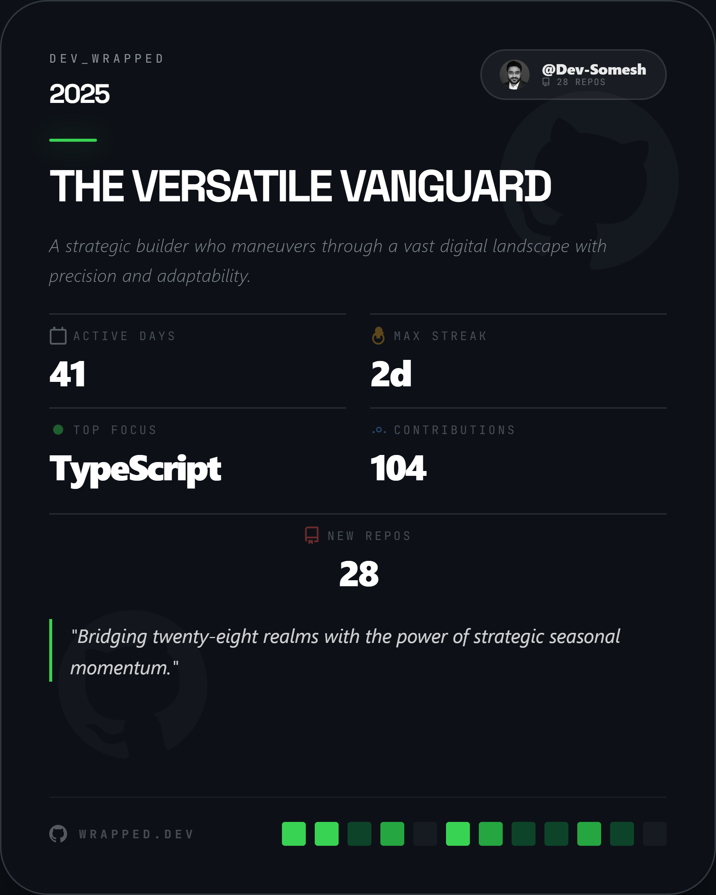
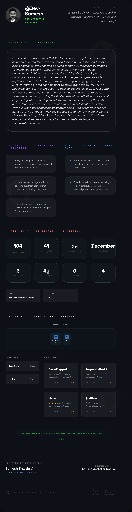

# DevWrapped 2025 - Comprehensive Documentation

<div align="center">

<h1 style="font-size: 3rem; font-weight: 900; letter-spacing: -0.05em;">
  <span style="color: #39d353;">DEV</span><span style="color: #58a6ff;">_</span><span style="color: #bc8cff;">WRAPPED</span>
</h1>

<sub style="color: #8b949e;">2025 - Complete Developer Documentation</sub>

</div>

## 📋 Table of Contents

1. [Project Overview](#project-overview)
2. [Architecture](#architecture)
3. [Installation & Setup](#installation--setup)
4. [Environment Configuration](#environment-configuration)
5. [Development Guide](#development-guide)
6. [Deployment](#deployment)
7. [API Documentation](#api-documentation)
8. [Component Architecture](#component-architecture)
9. [Security & Privacy](#security--privacy)
10. [Performance Optimization](#performance-optimization)
11. [Troubleshooting](#troubleshooting)
12. [Contributing](#contributing)

---

## 🎯 Project Overview

**DevWrapped 2025** is an advanced Year-in-Review application that transforms GitHub activity data into compelling visual narratives using AI-powered insights. The application provides developers with a comprehensive analysis of their coding journey throughout 2025.

### Key Features

- **AI-Powered Analysis**: Uses Google Gemini AI to generate personalized developer insights
- **Comprehensive GitHub Integration**: Analyzes commits, languages, repositories, and activity patterns
- **Visual Data Presentation**: Beautiful cards and dossiers with interactive elements
- **Privacy-First Architecture**: Zero data retention, client-side processing
- **Streamlined User Experience**: Direct flow from input to results
- **Export Capabilities**: High-quality image export for sharing

## 🎨 Visual Showcase

<div align="center">

### Landing Experience

<p><em>Elegant landing page with animated GitHub logos and professional input interface</em></p>

### Share Card Output

<p><em>Compact summary card perfect for social media sharing</em></p>

### Detailed Analysis

<p><em>Comprehensive dossier with repository analysis, tech stack, and activity visualization</em></p>

</div>

### Technology Stack

- **Frontend**: React 19, TypeScript, Tailwind CSS
- **AI Engine**: Google Gemini (Flash/Lite models)
- **Backend**: Netlify Functions (Serverless)
- **Build Tool**: Vite
- **Styling**: Tailwind CSS with custom animations
- **Export**: html-to-image library

---

## 🏗️ Architecture

### System Architecture

```
┌─────────────────┐    ┌──────────────────┐    ┌─────────────────┐
│   React Client  │    │ Netlify Functions│    │  External APIs  │
│                 │    │                  │    │                 │
│ ┌─────────────┐ │    │ ┌──────────────┐ │    │ ┌─────────────┐ │
│ │ Landing     │ │    │ │ github-proxy │ │────┤ │ GitHub API  │ │
│ │ Loading     │ │    │ │ gemini-proxy │ │    │ │ Gemini API  │ │
│ │ ShareCard   │ │    │ └──────────────┘ │    │ └─────────────┘ │
│ │ Dossier     │ │    └──────────────────┘    └─────────────────┘
│ └─────────────┘ │
└─────────────────┘
```

### Data Flow

1. **User Input**: Username and optional PAT token
2. **GitHub Data Fetch**: Serverless function fetches user data
3. **AI Processing**: Gemini AI generates insights and narratives
4. **Visualization**: React components render interactive cards
5. **Export**: Users can export high-quality images

### Component Hierarchy

```
App.tsx
├── BackgroundIcons (Animated GitHub logos)
├── Landing (User input form)
├── Loading (Analysis progress)
└── Share Page
    ├── ShareCard (Summary card with key stats)
    └── DevelopmentDossier (Detailed analysis)
```

---

## 🚀 Installation & Setup

### Prerequisites

- Node.js 18+ 
- npm or yarn
- Git
- Google Cloud account (for Gemini API)
- Netlify account (for deployment)

### Local Development Setup

1. **Clone the repository**
   ```bash
   git clone <repository-url>
   cd devwrapped-2025
   ```

2. **Install dependencies**
   ```bash
   npm install
   ```

3. **Environment setup**
   ```bash
   cp .env.example .env
   # Edit .env with your API keys
   ```

4. **Start development server**
   ```bash
   npm run dev
   # or for Netlify dev environment
   npm run dev:netlify
   ```

5. **Access the application**
   - Local: `http://localhost:3000`
   - Netlify Dev: `http://localhost:8888`

---

## 🔧 Environment Configuration

### Required Environment Variables

Create a `.env` file in the root directory:

```env
# Google Gemini API Configuration
GEMINI_API_KEY=your_gemini_api_key_here

# Optional: GitHub Personal Access Token (for higher rate limits)
GITHUB_TOKEN=your_github_token_here
```

### Netlify Environment Variables

For production deployment, set these in Netlify Dashboard:

1. Go to Site Settings → Environment Variables
2. Add the following variables:
   - `GEMINI_API_KEY`: Your Google Gemini API key
   - `GITHUB_TOKEN`: (Optional) GitHub PAT for higher rate limits

### API Key Setup

#### Google Gemini API Key
1. Visit [Google AI Studio](https://ai.google.dev)
2. Create a new project or select existing
3. Enable Gemini API
4. Generate API key
5. Add to environment variables

#### GitHub Token (Optional)
1. Go to GitHub Settings → Developer Settings → Personal Access Tokens
2. Generate new token with `public_repo` scope
3. Add to environment variables

---

## 💻 Development Guide

### Project Structure

```
devwrapped-2025/
├── components/           # React components
│   ├── Landing.tsx      # User input form
│   ├── Loading.tsx      # Loading animation
│   ├── ShareCard.tsx    # Summary card component
│   └── DevelopmentDossier.tsx # Detailed analysis
├── services/            # API services
│   ├── githubService.ts # GitHub API integration
│   ├── geminiService.ts # Gemini AI integration
│   └── security.ts     # Security utilities
├── netlify/functions/   # Serverless functions
│   ├── github-proxy.ts # GitHub API proxy
│   └── gemini-proxy.ts # Gemini API proxy
├── types.ts            # TypeScript type definitions
├── App.tsx             # Main application component
├── index.tsx           # Application entry point
└── index.css           # Global styles
```

### Key Components

#### App.tsx
Main application component managing:
- Application state (step, stats, insights)
- User flow navigation
- Error handling
- Background animations

#### ShareCard.tsx
Summary card component featuring:
- Key statistics display
- Export functionality
- Responsive design
- GitHub logo backgrounds

#### DevelopmentDossier.tsx
Detailed analysis component including:
- Repository cards
- Activity grid visualization
- Tech stack cloud
- Professional profile section
- Comprehensive metrics

### Services

#### githubService.ts
Handles GitHub API integration:
- User profile data
- Repository information
- Commit activity analysis
- Language statistics
- Rate limit handling

#### geminiService.ts
Manages AI-powered insights:
- Prompt engineering
- Response parsing
- Error handling
- Model selection (Flash/Lite)

### Styling Guidelines

- **Tailwind CSS**: Utility-first CSS framework
- **Color Scheme**: GitHub-inspired dark theme
- **Typography**: Space Grotesk (display), JetBrains Mono (code)
- **Animations**: CSS animations for smooth transitions
- **Responsive**: Mobile-first responsive design

---

## 🚀 Deployment

### Netlify Deployment

1. **Connect Repository**
   - Link your GitHub repository to Netlify
   - Set build command: `npm run build`
   - Set publish directory: `dist`

2. **Environment Variables**
   - Add `GEMINI_API_KEY` in Site Settings
   - Add `GITHUB_TOKEN` (optional)

3. **Deploy**
   - Automatic deployment on git push
   - Preview deployments for pull requests

### Build Configuration

The `netlify.toml` file configures:
- Build settings
- Function directory
- Development server settings
- Timeout configurations

### Performance Considerations

- **Function Timeouts**: Optimized for Netlify's 10s limit
- **Bundle Size**: Optimized with Vite's tree shaking
- **Image Optimization**: Efficient SVG usage
- **Lazy Loading**: Components loaded on demand

---

## 📡 API Documentation

### GitHub Proxy Function

**Endpoint**: `/.netlify/functions/github-proxy`

**Purpose**: Securely proxy GitHub API requests

**Parameters**:
- `username`: GitHub username (required)
- `token`: Personal access token (optional)

**Response**: GitHub user data and repository information

### Gemini Proxy Function

**Endpoint**: `/.netlify/functions/gemini-proxy`

**Purpose**: Process GitHub data through Gemini AI

**Parameters**:
- `stats`: GitHub statistics object
- `model`: AI model selection

**Response**: AI-generated insights and narratives

### Rate Limiting

- **GitHub API**: 60 requests/hour (unauthenticated), 5000/hour (authenticated)
- **Gemini API**: Based on your Google Cloud quotas
- **Function Limits**: 10s timeout per function call

---

## 🧩 Component Architecture

### State Management

The application uses React's built-in state management:

```typescript
// Main application state
const [step, setStep] = useState<Step>(Step.Entry);
const [stats, setStats] = useState<GitHubStats | null>(null);
const [insights, setInsights] = useState<AIInsights | null>(null);
const [error, setError] = useState<string | null>(null);
```

### Type Definitions

Key TypeScript interfaces:

```typescript
interface GitHubStats {
  username: string;
  name: string;
  bio: string;
  company: string;
  location: string;
  followers: number;
  following: number;
  publicRepos: number;
  // ... additional fields
}

interface AIInsights {
  summary: string;
  archetype: string;
  narrative: string;
  // ... additional fields
}
```

### Component Props

Components receive data through well-defined props:

```typescript
interface ShareCardProps {
  stats: GitHubStats;
  insights: AIInsights;
  onReset: () => void;
}
```

---

## 🔒 Security & Privacy

### Privacy-First Design

- **Zero Data Retention**: No user data stored on servers
- **Client-Side Processing**: All analysis happens in browser
- **Secure API Keys**: Server-side storage only
- **No Tracking**: No analytics or tracking cookies

### Security Measures

- **API Key Protection**: Never exposed to client
- **Input Validation**: Sanitized user inputs
- **Rate Limiting**: Prevents API abuse
- **Error Handling**: Secure error messages

### GDPR Compliance

- No personal data collection
- No cookies or tracking
- User data processed locally
- No data retention policies needed

---

## ⚡ Performance Optimization

### Bundle Optimization

- **Tree Shaking**: Unused code elimination
- **Code Splitting**: Dynamic imports where beneficial
- **Asset Optimization**: Optimized SVGs and images

### Runtime Performance

- **Memoization**: React.useMemo for expensive calculations
- **Lazy Loading**: Components loaded on demand
- **Efficient Rendering**: Optimized re-render cycles

### Network Optimization

- **API Batching**: Minimize API calls
- **Caching**: Browser caching for static assets
- **Compression**: Gzip compression enabled

---

## 🐛 Troubleshooting

### Common Issues

#### API Key Errors
```
Error: AUTHENTICATION_FAILED: API key configuration error
```
**Solution**: Verify `GEMINI_API_KEY` is set in Netlify environment variables

#### Rate Limit Errors
```
Error: RATE_LIMIT: Service quota reached
```
**Solution**: Wait for rate limit reset or add GitHub token

#### Build Failures
```
Error: Module not found
```
**Solution**: Run `npm install` and check dependencies

### Debug Mode

Enable debug logging by setting:
```env
NODE_ENV=development
```

### Performance Issues

- Check network tab for slow API calls
- Monitor console for React warnings
- Use React DevTools for component analysis

---

## 🤝 Contributing

### Development Workflow

1. **Fork the repository**
2. **Create feature branch**
   ```bash
   git checkout -b feature/your-feature-name
   ```
3. **Make changes and test**
4. **Commit with conventional commits**
   ```bash
   git commit -m "feat: add new feature"
   ```
5. **Push and create pull request**

### Code Standards

- **TypeScript**: Strict type checking enabled
- **ESLint**: Code linting rules
- **Prettier**: Code formatting
- **Conventional Commits**: Commit message format

### Testing

- Manual testing for UI components
- API endpoint testing
- Cross-browser compatibility testing

---

## 📞 Support & Contact

### Getting Help

- **Documentation**: This comprehensive guide
- **Issues**: GitHub Issues for bug reports
- **Discussions**: GitHub Discussions for questions

### Contact Information

- **Developer**: Somesh Bhardwaj
- **Email**: hello@someshbhardwaj.me
- **Portfolio**: [someshbhardwaj.me](https://someshbhardwaj.me)
- **LinkedIn**: [ersomeshbhardwaj](https://www.linkedin.com/in/ersomeshbhardwaj/)

---

## 📄 License

This project is licensed under the MIT License. See the LICENSE file for details.

---

## 🙏 Acknowledgments

DevWrapped 2025 is made possible by the incredible technologies and services provided by:

### AI & Intelligence
- **[Google Gemini AI](https://ai.google.dev/)** - Powering intelligent insights and narrative generation with advanced language models

### Data & APIs  
- **[GitHub API](https://docs.github.com/en/rest)** - Comprehensive developer data and repository insights that form the foundation of our analysis

### Infrastructure & Deployment
- **[Netlify](https://netlify.com)** - Serverless functions and seamless deployment platform enabling scalable, secure hosting

### Frontend Technologies
- **[React](https://react.dev)** - Modern UI framework for creating interactive and responsive user experiences
- **[Tailwind CSS](https://tailwindcss.com)** - Utility-first CSS framework enabling rapid, consistent styling
- **[Vite](https://vitejs.dev)** - Lightning-fast build tool and development server for optimal development experience

### Development Tools
- **[TypeScript](https://typescriptlang.org)** - Type-safe JavaScript ensuring robust, maintainable code
- **[html-to-image](https://github.com/bubkoo/html-to-image)** - High-quality image export functionality for sharing capabilities

### Special Recognition
We extend our gratitude to the open-source community and the organizations that provide generous APIs and tools, making projects like DevWrapped possible. Each technology contributes to creating a seamless, intelligent, and beautiful experience for developers worldwide.

---

<p align="center">
  <b>Built with ❤️ by <a href="https://someshbhardwaj.me">Somesh Bhardwaj</a></b><br />
  <span style="opacity: 0.3; font-family: monospace; font-size: 10px; letter-spacing: 5px;">*** END_OF_DOCUMENTATION_2025 ***</span>
</p>