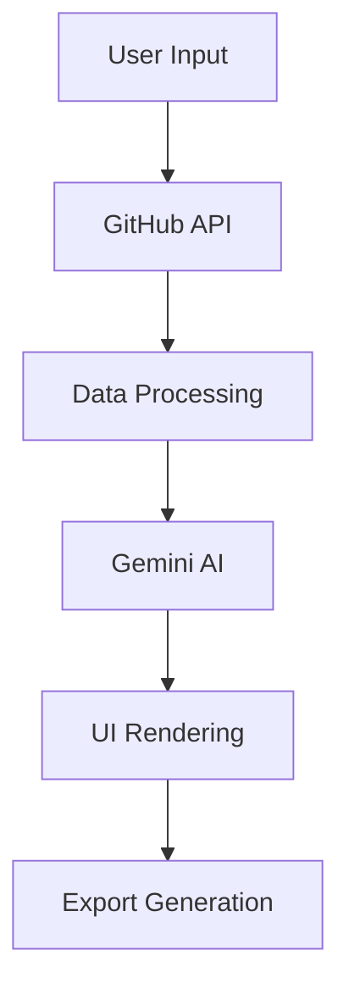

# 📖 DevWrapped 2025 - Complete Documentation

<div align="center">
  <h1>🎬 DevWrapped 2025</h1>
  <p><em>Transform your GitHub journey into a cinematic year-in-review experience</em></p>
  
  
  
  
  
</div>

---

## 📋 Table of Contents

1. [🎯 Project Overview](#-project-overview)
2. [🏗️ Architecture](#️-architecture)
3. [🚀 Getting Started](#-getting-started)
4. [📱 Mobile Optimization](#-mobile-optimization)
5. [🔧 Configuration](#-configuration)
6. [🎨 Features & Components](#-features--components)
7. [🔌 API Integration](#-api-integration)
8. [🚀 Deployment](#-deployment)
9. [🐛 Troubleshooting](#-troubleshooting)
10. [🤝 Contributing](#-contributing)

---

## 🎯 Project Overview

**DevWrapped 2025** is a sophisticated web application that transforms GitHub activity data into personalized, AI-generated year-in-review experiences. Built with modern web technologies and powered by Google Gemini AI, it creates cinematic narratives from developer contributions.

### ✨ Key Features

- **🤖 AI-Powered Insights**: Personalized narratives using Google Gemini with **AEO (AI Engine Optimization)**
- **📊 Comprehensive Analytics**: Detailed GitHub activity analysis with year selection
- **📅 Smart Year Selection**: Choose analysis year with GitHub API limitation awareness
- **📱 Mobile-First Design**: Fully responsive across all devices
- **🎨 Beautiful Visualizations**: GitHub-inspired design with smooth animations
- **📤 Export Capabilities**: High-quality image generation for sharing
- **🔒 Privacy-First**: No data retention, client-side processing, anonymous analytics only
- **⚡ Performance Optimized**: Fast loading and smooth interactions
- **🧠 Advanced AI Engine**: 10 distinct developer archetypes with confidence scoring

### 🎭 What Users Get

1. **Share Card**: Compact summary perfect for social media
2. **Development Dossier**: Detailed analysis with repository insights
3. **Monthly Activity Grid**: Visual contribution patterns
4. **Tech Stack Visualization**: Color-coded technology usage
5. **AI-Generated Narrative**: Personalized development story with year-specific context
6. **Developer Archetype**: One of 10 distinct personas (The Architect, The Explorer, etc.)
7. **Forward-Looking Insights**: Actionable recommendations and growth opportunities
8. **Data Transparency**: Clear information about GitHub API limitations and data quality

---

## 🏗️ Architecture

### 📁 Project Structure

```
devwrapped-2025/
├── 📁 components/           # React components
│   ├── 🎯 Landing.tsx       # Landing page with input form
│   ├── 📊 DevelopmentDossier.tsx  # Main dossier component
│   ├── 🎨 ShareCard.tsx     # Social media share card
│   ├── ⏳ Loading.tsx       # Loading animation
│   └── 📋 CreditsModal.tsx  # Credits and acknowledgments
├── 📁 services/            # API and business logic
│   ├── 🐙 githubService.ts  # GitHub API integration
│   ├── 🤖 geminiService.ts  # Google Gemini AI integration
│   └── 🔒 security.ts      # Security and logging utilities
├── 📁 netlify/functions/   # Serverless functions
│   ├── 🐙 github-proxy.ts  # GitHub API proxy
│   └── 🤖 gemini-proxy.ts  # Gemini AI proxy
├── 📁 assets/              # Static assets and images
├── 🎨 index.css            # Global styles and mobile optimizations
├── 📝 types.ts             # TypeScript type definitions
├── ⚛️ App.tsx              # Main application component
└── 🏠 index.tsx            # Application entry point
```

### 🔄 Data Flow



1. **User Input**: GitHub username submission
2. **Data Fetching**: Parallel GitHub API calls for comprehensive data
3. **Processing**: Centralized contribution calculation and analysis
4. **AI Generation**: Gemini AI creates personalized insights
5. **Rendering**: Dynamic UI with responsive components
6. **Export**: High-quality image generation for sharing

---

## 🚀 Getting Started

### 📋 Prerequisites

- **Node.js**: Version 18+ recommended
- **npm**: Version 8+ or yarn
- **Google Gemini API Key**: Required for AI features
- **Modern Browser**: Chrome, Firefox, Safari, or Edge

### 🛠️ Installation

1. **Clone the Repository**
   ```bash
   git clone https://github.com/Dev-Somesh/Dev-Wrapped.git
   cd Dev-Wrapped
   ```

2. **Install Dependencies**
   ```bash
   npm install
   ```

3. **Environment Setup**
   ```bash
   # Create .env file
   cp .env.example .env
   
   # Add your API keys
   echo "GEMINI_API_KEY=your_gemini_api_key_here" >> .env
   echo "VITE_MIXPANEL_TOKEN=your_mixpanel_token_here" >> .env
   ```

4. **Development Server**
   ```bash
   # Start Vite dev server
   npm run dev
   
   # Or start with Netlify functions
   npm run dev:netlify
   ```

5. **Production Build**
   ```bash
   npm run build
   npm run preview
   ```

### 🔑 API Keys Setup

#### Google Gemini API Key
1. Visit [Google AI Studio](https://makersuite.google.com/app/apikey)
2. Create a new API key
3. Add to your `.env` file as `GEMINI_API_KEY`

#### Mixpanel Analytics Token
1. Visit [Mixpanel](https://mixpanel.com) and create an account
2. Create a new project
3. Copy your project token
4. Add to your `.env` file as `VITE_MIXPANEL_TOKEN`

**Note**: GitHub API access is public-only and doesn't require authentication.

---

## 📱 Mobile Optimization

DevWrapped 2025 is fully optimized for mobile devices with comprehensive responsive design.

### 🎯 Mobile Features

#### **Monthly Activity Grid**
- **Desktop**: Single row of 12 blocks (8x8px each)
- **Mobile**: 2 rows of 6 blocks (6x6px each) for better fit
- **Touch-Friendly**: Optimized spacing and sizing
- **Responsive Text**: Scales appropriately across devices

#### **Landing Page**
- **Responsive Typography**: Hero text scales from 7.5rem to 3xl on mobile
- **Touch Targets**: All interactive elements meet 44px minimum
- **Compact Navigation**: Smaller branding, hidden feature pills on mobile
- **Optimized Forms**: Better input sizing and touch responsiveness

#### **Development Dossier**
- **Flexible Layout**: Profile info stacks vertically on mobile
- **Grid Optimization**: Metrics display as 2x4 grid instead of 1x8
- **Responsive Cards**: Smaller padding and text for mobile screens
- **Mobile Export**: Shortened button text and optimized sizing

### 📐 Responsive Breakpoints

```css
/* Mobile First Approach */
/* Default: Mobile (< 640px) */
.text-base { font-size: 1rem; }

/* Tablet: sm (640px+) */
@media (min-width: 640px) {
  .sm:text-lg { font-size: 1.125rem; }
}

/* Desktop: md (768px+) */
@media (min-width: 768px) {
  .md:text-xl { font-size: 1.25rem; }
}

/* Large Desktop: lg (1024px+) */
@media (min-width: 1024px) {
  .lg:text-2xl { font-size: 1.5rem; }
}
```

### 🎨 Mobile-Specific Optimizations

#### **CSS Enhancements**
```css
/* Mobile touch improvements */
@media (max-width: 768px) {
  /* Improve touch targets */
  button, a, input {
    min-height: 44px;
  }
  
  /* Prevent horizontal scroll */
  html, body {
    overflow-x: hidden;
    width: 100%;
  }
  
  /* Optimize text rendering */
  * {
    -webkit-tap-highlight-color: transparent;
  }
}
```

#### **Performance Optimizations**
- **Font Smoothing**: `-webkit-font-smoothing: antialiased`
- **Text Size Adjust**: `-webkit-text-size-adjust: 100%` (prevents iOS zoom)
- **Thinner Scrollbars**: 4px width on mobile vs 8px on desktop
- **Touch Optimizations**: Removed tap highlights, improved responsiveness

---

## 📊 Analytics & Privacy

### 🔍 User Analytics with Mixpanel

DevWrapped 2025 uses **Mixpanel** for user experience analytics to improve the product while maintaining privacy:

#### **What We Track**
- **Page Views**: App usage and navigation patterns
- **Feature Usage**: Which features are most popular
- **AI Interactions**: Launch AI, analysis completion, export actions
- **Error Tracking**: Technical issues for debugging
- **Social Sharing**: Platform preferences and sharing patterns

#### **What We DON'T Track**
- **Personal Data**: No emails, names, or sensitive information
- **GitHub Content**: No code, commit messages, or repository content
- **Browsing History**: No tracking outside the app
- **Cross-Site Tracking**: No cookies or persistent identifiers

#### **Privacy-First Approach**
- **Anonymous Analytics**: User identification by GitHub username only
- **No Data Retention**: Analytics data used for insights, not storage
- **Opt-Out Friendly**: Respects Do Not Track headers
- **Transparent**: All tracking events are documented

#### **Tracked Events**
```typescript
// Core user journey
'Page View'              // App loads
'Launch AI'              // Analysis starts
'AI Response Sent'       // Analysis completes
'Conversion Event'       // Successful analysis

// Feature interactions
'Share Card Viewed'      // Results page viewed
'Share Card Export'      // Image download
'Social Platform Opened' // Social sharing
'Personalized Text Copied' // Text sharing

// Error monitoring
'Error'                  // General errors
'API Error'              // API failures
```

---

## 🔧 Configuration

### 🌍 Environment Variables

```bash
# Required
GEMINI_API_KEY=your_gemini_api_key_here

# Analytics (Required for production)
VITE_MIXPANEL_TOKEN=your_mixpanel_token_here

# Optional (for development)
GITHUB_TOKEN=your_github_token_here  # Not used in production
```

### ⚙️ Netlify Configuration

**netlify.toml**
```toml
[build]
  command = "npm run build"
  publish = "dist"

[functions]
  directory = "netlify/functions"

[[redirects]]
  from = "/*"
  to = "/index.html"
  status = 200

[build.environment]
  NODE_VERSION = "18"
```

### 🎛️ Vite Configuration

**vite.config.ts**
```typescript
import { defineConfig } from 'vite'
import react from '@vitejs/plugin-react'

export default defineConfig({
  plugins: [react()],
  build: {
    outDir: 'dist',
    sourcemap: true,
    rollupOptions: {
      output: {
        manualChunks: {
          vendor: ['react', 'react-dom'],
          ai: ['@google/genai'],
          utils: ['html-to-image']
        }
      }
    }
  },
  server: {
    port: 3000,
    host: true
  }
})
```

---

## 🎨 Features & Components

### 🎯 Core Components

#### **1. Landing Component**
- **Purpose**: User input and initial interaction
- **Features**: 
  - Animated background with floating GitHub icons
  - Responsive form with validation
  - Feature preview cards (hidden on mobile)
  - Professional branding and navigation

#### **2. DevelopmentDossier Component**
- **Purpose**: Main content display with comprehensive analysis
- **Sections**:
  - **Header**: User profile with archetype classification
  - **Section I**: AI-generated narrative
  - **Section II**: Intelligence observations
  - **Section III**: Behavioral patterns
  - **Section IV**: Core contribution metrics (mobile: 2x4 grid)
  - **Section V**: Technical DNA landscape
  - **Monthly Activity**: 2025 contribution visualization
- **Export**: High-quality PNG generation

#### **3. ShareCard Component**
- **Purpose**: Compact social media sharing format
- **Features**:
  - Key statistics summary
  - Archetype display
  - Export functionality
  - Mobile-optimized layout

### 📊 Data Processing

#### **Centralized Contribution Calculation**
```typescript
const calculateContributionStats = (events: any[], repos: any[]) => {
  const year2025Start = new Date('2025-01-01');
  const today = new Date();
  
  // Filter events for 2025 only
  const events2025 = events.filter(event => {
    const eventDate = new Date(event.created_at);
    return eventDate >= year2025Start && eventDate <= today;
  });
  
  // Process contributions with consistent logic
  // ... detailed implementation
  
  return {
    totalContributions,
    activeDays,
    monthlyActivity,
    // ... other metrics
  };
};
```

#### **Monthly Activity Grid**
- **Desktop**: Single row of 12 monthly blocks
- **Mobile**: 2 rows of 6 blocks each
- **Color Coding**: 5-level GitHub-style activity visualization
- **Data Source**: Centralized contribution calculation
- **Responsive**: Adapts sizing and layout per device

---

## 🧠 AI Engine Optimization (AEO)

DevWrapped 2025 features advanced **AI Engine Optimization (AEO)** for superior AI-generated insights and narratives.

### 🎯 AEO Features

#### **Dynamic Year-Aware Prompting**
- **Context-Aware**: AI prompts adapt based on selected analysis year
- **Data Quality Indicators**: AI receives explicit information about GitHub API limitations
- **Temporal Context**: Prompts include current date and analysis year for accurate framing

#### **Enhanced Data Context**
- **Comprehensive Telemetry**: AI receives 20+ data points including:
  - Contribution distribution across months
  - Recent project details with languages and stars
  - Profile context (bio, company, location)
  - Community engagement metrics
  - Account maturity indicators

#### **Advanced Model Configuration**
```typescript
config: {
  temperature: 0.7,        // Balanced creativity vs consistency
  topK: 40,               // Focused vocabulary selection
  topP: 0.9,              // High-quality token sampling
  maxOutputTokens: 4096,  // Sufficient for detailed analysis
  candidateCount: 1       // Single high-quality response
}
```

#### **10 Distinct Developer Archetypes**
1. **The Architect**: High repo breadth + consistent patterns + complex languages
2. **The Explorer**: 4+ languages + diverse projects + experimental activity
3. **The Craftsperson**: Deep focus + quality over quantity + refined tech stack
4. **The Collaborator**: High social metrics + team repos + consistent contributions
5. **The Innovator**: New repos created + cutting-edge stack + burst patterns
6. **The Maintainer**: Long streaks (30+) + steady patterns + established projects
7. **The Specialist**: Deep expertise in 1-2 languages + focused domain
8. **The Builder**: High commit volume + multiple active projects + creation-focused
9. **The Contributor**: Open source focus + community engagement + diverse contributions
10. **The Learner**: Rapid skill acquisition + educational repos + growth trajectory

#### **Performance Monitoring**
- **Processing Time Tracking**: Monitor AI response times
- **Quality Validation**: Automatic response structure validation
- **Error Classification**: 7 distinct error types with specific handling
- **Diagnostic Logging**: Comprehensive error context for debugging

### 📅 Smart Year Selection

#### **GitHub API Limitation Awareness**
DevWrapped 2025 intelligently handles GitHub's 90-day public events API limitation:

```typescript
// Year availability calculation
const calculateYearAvailability = () => {
  const daysSinceYearStart = /* days since Jan 1 */;
  const GITHUB_EVENTS_LIMIT_DAYS = 90;
  
  if (daysSinceYearStart >= GITHUB_EVENTS_LIMIT_DAYS) {
    // Show current year only
    return { canShowYearSelection: false };
  } else {
    // Show both current and previous year
    return { canShowYearSelection: true };
  }
};
```

#### **User Experience**
- **Automatic Detection**: App determines available years based on current date
- **Clear Disclaimers**: Users see data limitation warnings
- **Smart Defaults**: Automatically selects the most appropriate year
- **Data Quality Indicators**: Shows partial/mixed data warnings

---

## 🔌 API Integration

### 🐙 GitHub API Integration

#### **Public Data Only**
- **No Authentication**: Uses public GitHub API endpoints
- **Rate Limits**: 60 requests/hour per IP (unauthenticated)
- **Data Sources**:
  - User profile information
  - Public repositories
  - Public events (last ~90 days)
  - Commit search (2025 data)

#### **Key Endpoints**
```typescript
// User profile
GET /users/{username}

// Public repositories
GET /users/{username}/repos?sort=updated&per_page=100

// Public events
GET /users/{username}/events/public?per_page=100

// Commit search (2025)
GET /search/commits?q=author:{username}+committer-date:>=2025-01-01
```

#### **Data Processing Pipeline**
1. **Parallel Fetching**: Multiple API calls for comprehensive data
2. **Pagination Handling**: Automatic pagination for repositories and events
3. **2025 Focus**: Filters all data to 2025 activity only
4. **Centralized Calculation**: Consistent metrics across all components
5. **Error Handling**: Graceful degradation with informative messages

### 🤖 Google Gemini AI Integration

#### **AI Models**
- **Primary**: `gemini-3-flash-preview` (full features)
- **Fallback**: `gemini-3-flash-lite` (economy mode)

#### **AI-Generated Content**
```typescript
interface AIInsights {
  archetype: string;              // Developer archetype (e.g., "The Night Owl")
  archetypeDescription: string;   // Brief archetype explanation
  narrative: string;              // Personalized development story
  cardInsight: string;           // One-line insight for share card
  insights: string[];            // Key observations
  patterns: string[];            // Behavioral patterns
}
```

#### **Prompt Engineering**
- **Context-Aware**: Uses actual GitHub data for personalization
- **Professional Tone**: Maintains technical accuracy with engaging narrative
- **Structured Output**: Consistent JSON format for reliable parsing
- **Error Handling**: Fallback content for AI failures

---

## 🚀 Deployment

### 🌐 Netlify Deployment

#### **Automatic Deployment**
1. **Connect Repository**: Link GitHub repo to Netlify
2. **Build Settings**:
   - Build command: `npm run build`
   - Publish directory: `dist`
   - Node version: `18`
3. **Environment Variables**: Add `GEMINI_API_KEY` in Netlify dashboard
4. **Deploy**: Automatic deployment on git push

#### **Manual Deployment**
```bash
# Build for production
npm run build

# Deploy to Netlify
npx netlify deploy --prod --dir=dist
```

#### **Serverless Functions**
- **GitHub Proxy**: `/.netlify/functions/github-proxy`
- **Gemini Proxy**: `/.netlify/functions/gemini-proxy`
- **CORS Handling**: Automatic CORS headers for cross-origin requests
- **Error Handling**: Structured error responses with logging

### 🔒 Security Considerations

#### **API Key Protection**
- **Server-Side Only**: API keys stored in Netlify environment
- **Proxy Pattern**: Client never directly accesses external APIs
- **Rate Limiting**: Built-in protection against abuse
- **Error Sanitization**: No sensitive data in client-side errors

#### **Privacy Protection**
- **No Data Storage**: Zero user data retention
- **Client-Side Processing**: All analysis happens in browser
- **No Tracking**: No analytics, cookies, or user identification
- **Secure Headers**: HTTPS-only, security headers enabled

---

## 🐛 Troubleshooting

### ❌ Common Issues

#### **1. API Key Errors**
```
ERROR: GEMINI_CONFIG_ERROR: GEMINI_API_KEY is not configured
```
**Solution**: 
- Verify API key is set in `.env` file
- For Netlify: Add key in dashboard environment variables
- Restart development server after adding key

#### **2. GitHub Rate Limiting**
```
ERROR: GITHUB_RATE_LIMIT: API rate limit exceeded
```
**Solution**:
- Wait for rate limit reset (1 hour for public API)
- Consider using GitHub token for higher limits (development only)
- Implement request caching for repeated testing

#### **3. Mobile Layout Issues**
**Symptoms**: Content overflow, poor touch targets, zoom issues
**Solution**:
- Verify viewport meta tag: `<meta name="viewport" content="width=device-width, initial-scale=1.0">`
- Check responsive classes: `sm:`, `md:`, `lg:` prefixes
- Test on actual devices, not just browser dev tools

#### **4. Export/Image Generation Failures**
```
ERROR: Export failed, falling back to print
```
**Solution**:
- Check `html-to-image` library compatibility
- Verify DOM element exists before export
- Test with different browsers (Chrome recommended)

### 🔍 Debug Mode

#### **Enable Detailed Logging**
```typescript
// In services/security.ts
const DEBUG_MODE = true; // Enable for development

// Enhanced logging
console.log('GitHub API Response:', response);
console.log('Contribution Stats:', stats);
```

#### **Network Debugging**
1. Open browser DevTools (F12)
2. Go to Network tab
3. Filter by "Fetch/XHR"
4. Monitor API calls and responses
5. Check for CORS errors or failed requests

### 📊 Performance Monitoring

#### **Key Metrics to Monitor**
- **API Response Times**: GitHub and Gemini API calls
- **Bundle Size**: Keep under 1MB for optimal loading
- **Mobile Performance**: Test on 3G networks
- **Memory Usage**: Monitor for memory leaks in long sessions

---

## 🤝 Contributing

### 🛠️ Development Setup

1. **Fork the Repository**
2. **Create Feature Branch**
   ```bash
   git checkout -b feature/amazing-feature
   ```
3. **Make Changes**
4. **Test Thoroughly**
   - Desktop and mobile testing
   - Multiple GitHub usernames
   - Error scenarios
5. **Commit with Conventional Commits**
   ```bash
   git commit -m "feat: add amazing new feature"
   ```
6. **Push and Create PR**

### 📝 Code Standards

#### **TypeScript**
- Strict mode enabled
- Proper type definitions
- No `any` types without justification
- Interface definitions for all data structures

#### **React**
- Functional components with hooks
- Proper dependency arrays for useEffect
- Memoization for expensive calculations
- Accessible components (ARIA labels, semantic HTML)

#### **CSS/Styling**
- Tailwind CSS utility classes
- Mobile-first responsive design
- Consistent spacing and typography
- Dark theme optimized

### 🧪 Testing Guidelines

#### **Manual Testing Checklist**
- [ ] Landing page loads correctly
- [ ] Form validation works
- [ ] GitHub data fetching succeeds
- [ ] AI insights generate properly
- [ ] Mobile layout is responsive
- [ ] Export functionality works
- [ ] Error handling is graceful

#### **Test Cases**
- **Valid usernames**: Active GitHub users with 2025 activity
- **Invalid usernames**: Non-existent users, empty input
- **Edge cases**: Users with no 2025 activity, private profiles
- **Mobile testing**: Various screen sizes and orientations
- **Network issues**: Slow connections, API failures

---

## 📚 Additional Resources

### 🔗 External Documentation
- [React 19 Documentation](https://react.dev/)
- [TypeScript Handbook](https://www.typescriptlang.org/docs/)
- [Tailwind CSS Documentation](https://tailwindcss.com/docs)
- [Google Gemini AI Documentation](https://ai.google.dev/docs)
- [GitHub API Documentation](https://docs.github.com/en/rest)
- [Netlify Functions Documentation](https://docs.netlify.com/functions/overview/)

### 🎨 Design Resources
- [GitHub Design System](https://primer.style/)
- [Color Palette Reference](https://github.com/primer/primitives)
- [Typography Guidelines](https://primer.style/design/foundations/typography)

### 🚀 Performance Resources
- [Web Vitals](https://web.dev/vitals/)
- [Mobile Performance Best Practices](https://web.dev/mobile/)
- [React Performance Optimization](https://react.dev/learn/render-and-commit)

---

## 📞 Support & Contact

### 🆘 Getting Help
- **GitHub Issues**: For bugs and feature requests
- **Email Support**: [hello@someshbhardwaj.me](mailto:hello@someshbhardwaj.me)
- **Documentation**: This comprehensive guide
- **Community**: GitHub Discussions (if enabled)

### 👨‍💻 About the Developer
**Somesh Bhardwaj** - Full Stack Developer & AI Enthusiast
- **Portfolio**: [someshbhardwaj.me](https://someshbhardwaj.me)
- **GitHub**: [@Dev-Somesh](https://github.com/Dev-Somesh)
- **LinkedIn**: [ersomeshbhardwaj](https://www.linkedin.com/in/ersomeshbhardwaj/)

---

<div align="center">
  <h3>🎉 Thank you for using DevWrapped 2025!</h3>
  <p><em>Transform your code journey into a cinematic experience</em></p>
  
  **[⭐ Star this project](https://github.com/Dev-Somesh/Dev-Wrapped)** if you found it helpful!
</div>

---

<p align="center">
  <sub>Last updated: December 2025 | Version 2025.1.0</sub><br>
  <sub>📱 Mobile Optimized | 🤖 AI Powered | 🔒 Privacy First</sub>
</p>